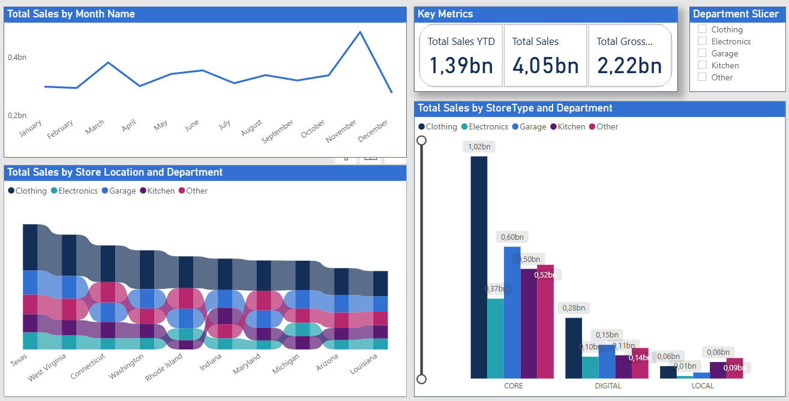
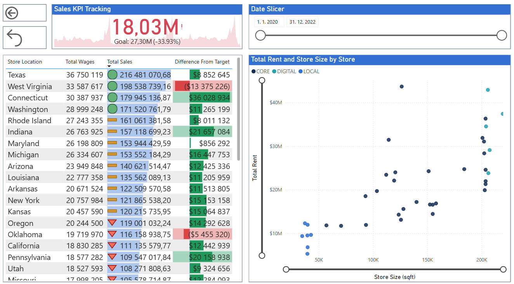

# Retail Sales Dashboard – Power BI Fundamentals Project  

## Project Overview  
This project was developed as part of the **Power BI Fundamentals** course. The dashboard analyzes retail sales performance across U.S. states, departments, and store types.  

While the overall structure followed the instructor’s guidance, I made several **customizations** to practice independent design choices — for example, replacing a map visualization with a line chart on the overview page to better highlight sales seasonality.  

The goal of this project was to strengthen my skills in:  
- Building interactive dashboards in **Power BI Desktop**  
- Using slicers for dynamic filtering  
- Tracking KPIs against targets  
- Designing multi-page reports with different perspectives  

## Dataset  
- **Source**: Provided by the *Power BI Fundamentals* course (synthetic training dataset).  
- **Content**: Sales transactions, store locations, product departments, wages, rent, and profitability.  
- **Purpose**: Used for learning Power BI features and dashboard design.  

## Objectives  
- Track sales KPIs vs. targets across states.  
- Compare sales by store type, size, and department.  
- Identify regions and departments contributing most to total revenue.  
- Explore cost drivers such as wages and rent.  

## Dashboard Pages  

**Page 1 – Retail Sales Overview**  
  
*High-level overview of total sales by month, KPIs (YTD, total sales, total gross profit), and breakdowns by store location, department, and store type. I customized this page by replacing a map with a line chart to highlight monthly sales trends.*  

**Page 2 – Cost and Target Tracking**  
  
*Focus on sales KPI tracking vs. goals, wages and sales performance by state, and the relationship between store rent and size.*  

## Files in this Repository  
- [Power_BI_practice.pbix](Power_BI_practice.pbix) → Power BI report file  
- [Screenshot_Power_BI_Sales_Page1.png](Screenshot_Power_BI_Sales_Page1.png) → Page 1 dashboard image  
- [Screenshot_Power_BI_CostandTarget_Page2.png](Screenshot_Power_BI_CostandTarget_Page2.png) → Page 2 dashboard image  

## Key Insights  
- Sales peak in December, showing strong seasonality.  
- Connecticut and Indiana exceeded targets, while West Virginia underperformed significantly.  
- Clothing consistently generates the highest sales, especially in **CORE** stores.  
- Store size correlates with higher rent, but not always with higher profitability.  

## Skills Practiced  
- Data modeling: building relationships between fact and dimension tables.  
- Data cleaning and transformation: using Power Query to shape raw data.  
- DAX basics: creating calculated columns and measures for KPIs.  
- Visualization design: selecting chart types, customizing formatting, and applying themes.  
- Dashboard storytelling: structuring multi-page reports to highlight insights.  
- Interactivity: using slicers and filters for dynamic exploration.  
